# Hostel-Management-System

This is a simple application created to manage the assignment of hostel rooms, primarily for students. It is intended for use by college staff to allocate rooms on a semester-by-semester basis, offering an interface that allows for efficient management of student and room information.  This application utilizes *OOAD* principles and using *Visual Studio .Net*.

## Application Requirements

1. **Semester-Based Room Allocation**:  
   - Allocation is performed on a semester basis. The college operates on a two-semester system per academic year.
   - All rooms are single occupancy, same type and are reset at the end of each semester.

2. **Hostel Structure**:  
   - The hostel comprises 4 floors, with 8 rooms on each floor.
   - Rooms are numbered from 1 to 8 on each floor, and floors are numbered from 1 to 4.

3. **Student Application Process**:  
   - Students must provide their name, registration number, and year and semester of study in the application form.
   - Each student must reapply at the end of a semester if they wish to stay for the next semester.

4. **Admin Staff Responsibilities**:  
   - Admin staff are responsible for processing applications by allocating available rooms to students.
   - Admin staff need to use the system to add, delete, modify, search, or list student and room information.

## Application Info

### Key Features

- **Room Allocation Management**: Allocate rooms to students for each semester.
- **Student Information Management**: Add, delete, modify, search, and list student details and their room assignments.
- **Admin Information Management**: There are two types of admin roles: *normal admin* and *advanced admin*. An advanced admin can modify admin records, such as deleting records and changing usernames and passwords, while a normal admin can only view student and hostel information.
- **File Handling**: Save all student and room information to a text file for data persistence.
- **Exception Handling**: Robust error handling to prevent application crashes and data loss.
- **Graphical User Interface (GUI)**: Intuitive interface for staff to manage hostel room allocation seamlessly.

### **Key Solution**

-  Implements a 2D array for the hostel layout to streamline room allocation and management from a coding perspective (e.g., [floor][unitNo]).
-  Defines two categories of admin with distinct access privileges using an abstract class.
-  Uses a *DataGridView* to present data items, providing a more flexible and interactive user experience within the application.

- The application features a dual-grid view layout:
    - Left GridView: Displays student information. Users can filter the view to show all students or search by criteria such as name, semester, room, or floor.
    - Right GridView: Shows hostel information. Users can search and filter to display all rooms, occupied rooms, or vacant rooms.

## Project Setup
1. **Set Up the C# Application**: Open the project in Visual Studio and create a separate class file for each `.cs` file provided. The program.cs should be the starting executed file.

2. **Build the Project**: Compile the project to generate the executable. Locate the `.exe` file in the `bin` folder of your project directory.

3. **Place the Text File**: Ensure that the *text file* is located in the same directory as the `.exe` file.

4. **Run the Application**: Execute the `.exe` file to start the application.
   
## Application Interface
### 1. Main Menu

  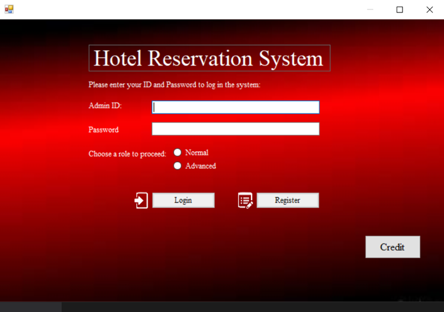

### 2. Register Admin

  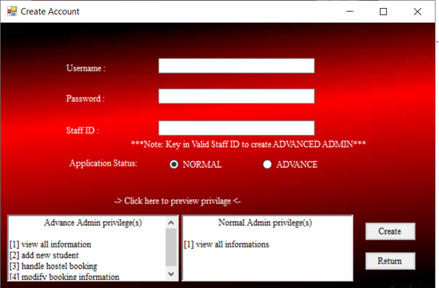

### 3. Advanced / Normal Admin Interface

  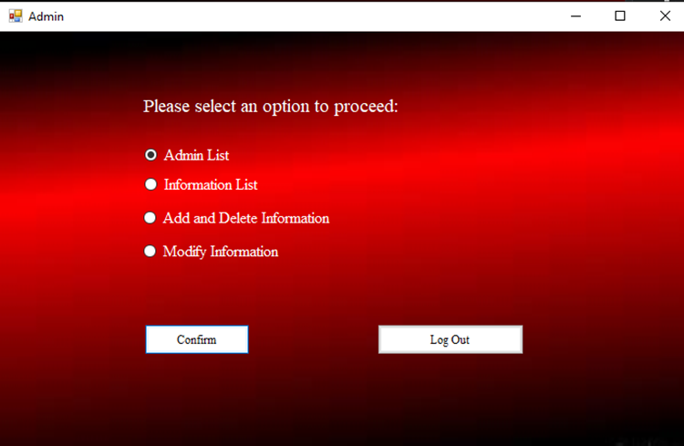
  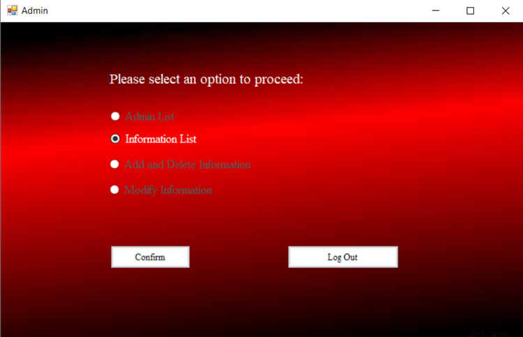

### 4. Display Admin Info

  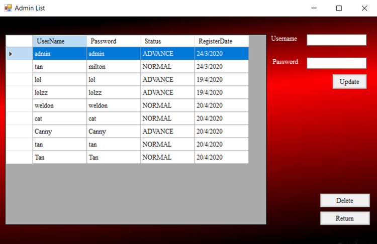

### 5. Display Student and Hostel Info
Left gridview display student info and can search by criteria such as name, semester, room and floor.
Right gridview display hostel info and can search by occupied or vacant rooms.

  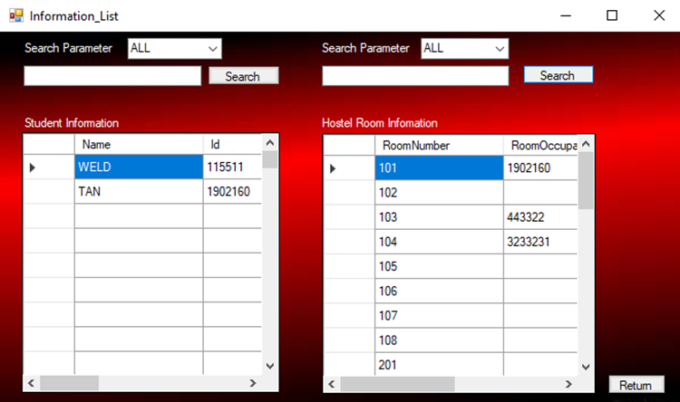
  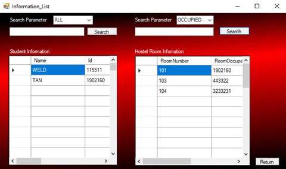

### 6. Add Student & Assign Hostel
This allow staff to add student, delete student, assign student to hostel room, remove hostel room reservation, etc.

  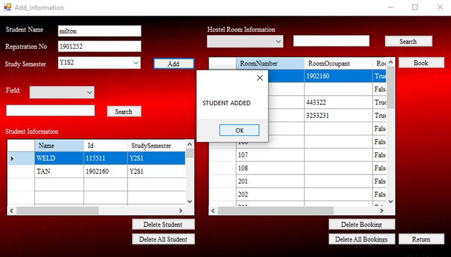
  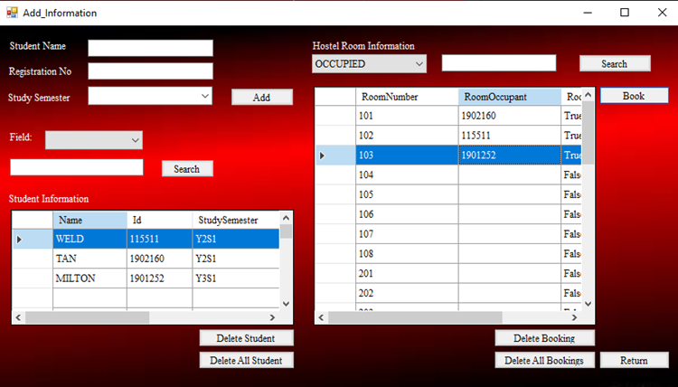

### 7. Modify Student and Hostel Info

  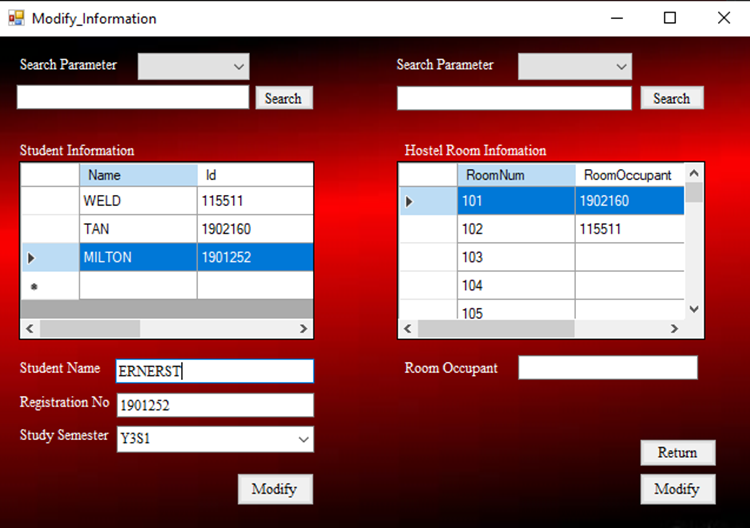
  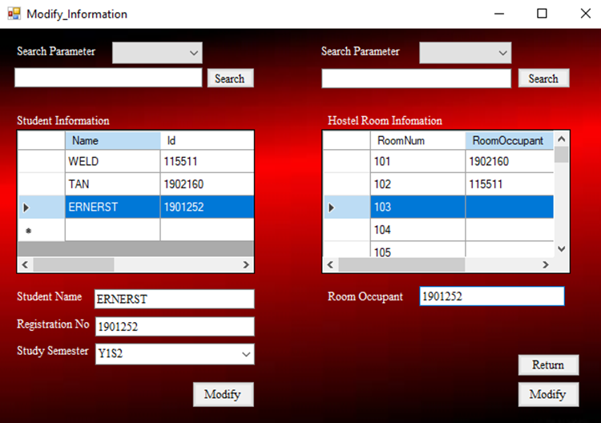

## Contributor
-   VICRACE CHAN JIA LIN
-   GOH WAYSIANG
-   TAN CARLSON
-   MILTON CHOO XIN HONG
-   TAN EONG SEANG 
